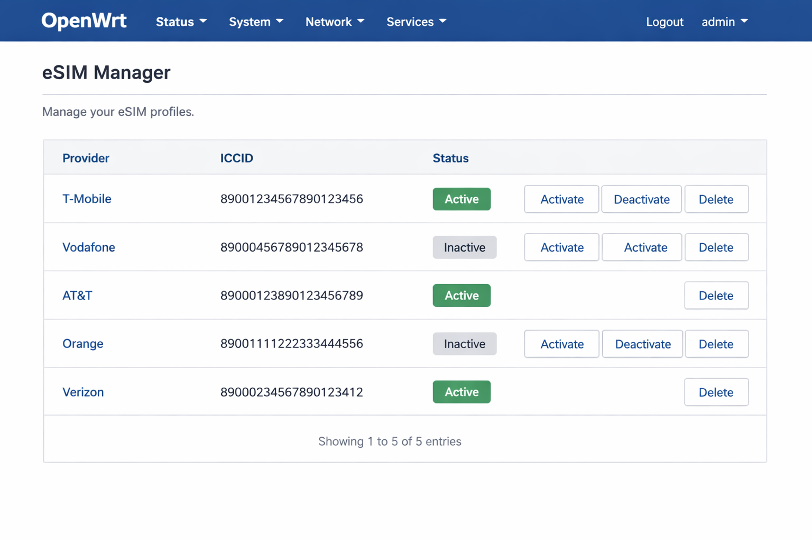
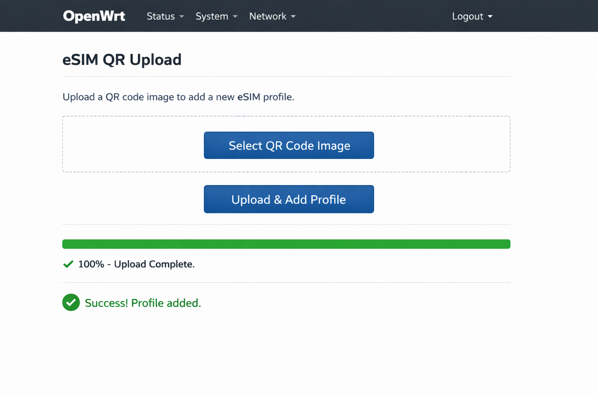

# luci-app-esim-qr (v1.1)

Enhanced eSIM Management for OpenWRT 25.12.2 (APK format).

## New Features
- **Profile Management**: List all profiles with provider names, ICCID, and status.
- **One-Click Actions**: Activate, Deactivate, or Delete profiles directly from LuCI.
- **QR Code Upload**: Upload eSIM QR images directly from LuCI; the system automatically extracts the LPA code and adds the profile via `lpac`.
- **Modem Monitoring**: Integrated with `luci-app-3ginfo-lite` for real-time modem status.
- **Data Usage**: Basic data usage monitoring and limit setup.
- **WAN Integration**: Optimized for modems like Quectel RM520N-EU.

## UI Preview
### eSIM Manager

### QR Upload

## Requirements
- `lpac`
- `zbar-tools`
- `libcurl`
- `vnstat`
- `luci-app-3ginfo-lite` (forked in your account)

## Installation
1. Add both `luci-app-esim-qr` and `luci-app-3ginfo-lite` to your SDK.
2. Select them in `make menuconfig`.
3. Build and install the `.apk` files.

## Credits
- [lpac](https://github.com/estkme-group/lpac)
- [4IceG/luci-app-3ginfo-lite](https://github.com/4IceG/luci-app-3ginfo-lite)
